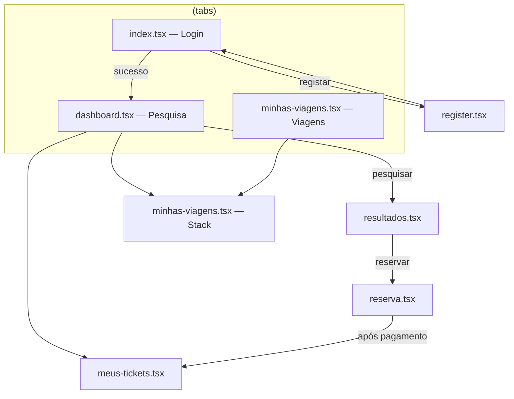
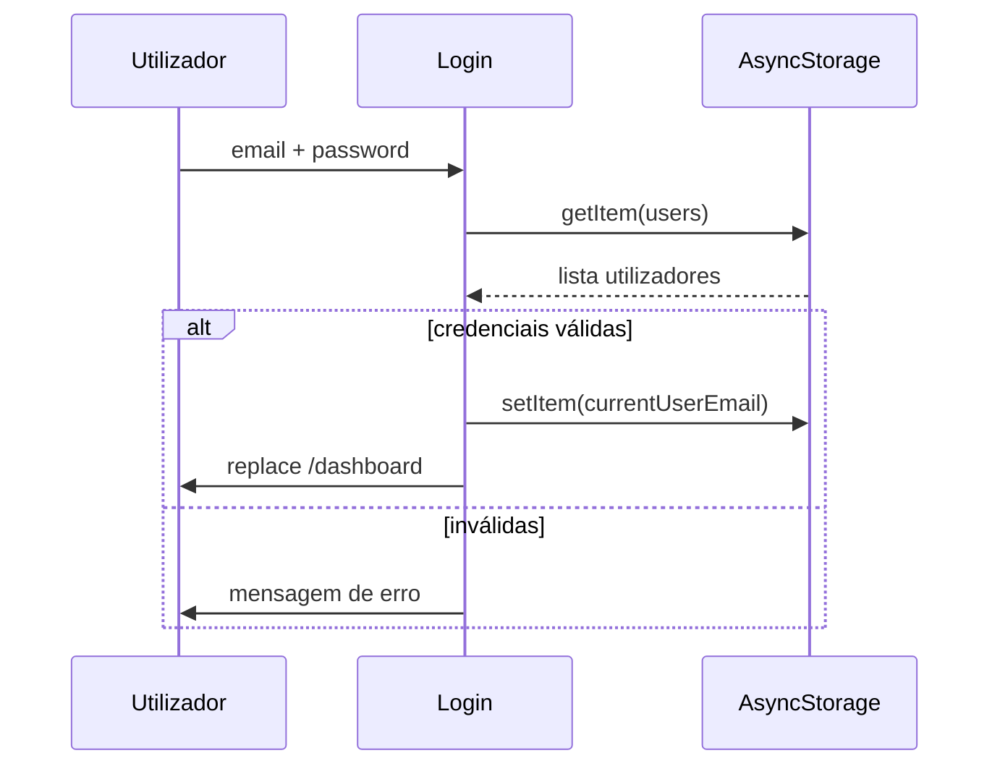
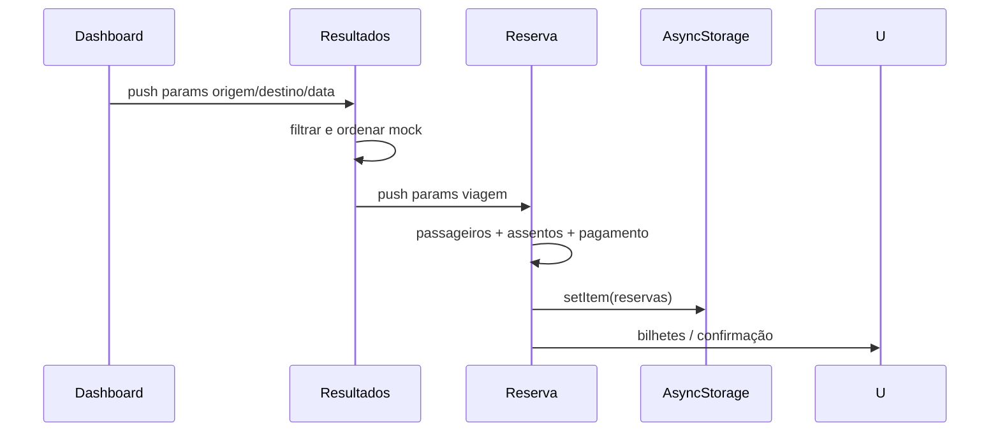

# Documentação Técnica — BusConecta

| Campo | Valor |
|-------|--------|
| **Projeto** | BusConecta Mobile |
| **Versão** | 1.0.0 |
| **Stack** | React Native · Expo · TypeScript |
| **Plataformas** | Android · iOS · Web (estático) |
| **Última atualização** | Maio 2026 |
| **Repositório** | `busconectaApp-main` |

---

## Índice

1. [Resumo executivo](#1-resumo-executivo)
2. [Objetivos e âmbito](#2-objetivos-e-âmbito)
3. [Stack tecnológica](#3-stack-tecnológica)
4. [Arquitetura da aplicação](#4-arquitetura-da-aplicação)
5. [Estrutura de diretórios](#5-estrutura-de-diretórios)
6. [Navegação e ecrãs](#6-navegação-e-ecrãs)
7. [Design system](#7-design-system)
8. [Biblioteca de componentes UI](#8-biblioteca-de-componentes-ui)
9. [Modelo de dados e persistência](#9-modelo-de-dados-e-persistência)
10. [Fluxos funcionais](#10-fluxos-funcionais)
11. [Integrações e dependências externas](#11-integrações-e-dependências-externas)
12. [Status Bar e áreas seguras](#12-status-bar-e-áreas-seguras)
13. [Instalação e execução](#13-instalação-e-execução)
14. [Scripts e qualidade de código](#14-scripts-e-qualidade-de-código)
15. [Configuração Expo (`app.json`)](#15-configuração-expo-appjson)
16. [Limitações e considerações de segurança](#16-limitações-e-considerações-de-segurança)
17. [Roadmap técnico sugerido](#17-roadmap-técnico-sugerido)
18. [Glossário](#18-glossário)

---

## 1. Resumo executivo

O **BusConecta** é uma aplicação móvel multiplataforma para **pesquisa, comparação e reserva de viagens de autocarro** em Angola. O utilizador autentica-se localmente, pesquisa rotas (origem, destino, datas), consulta resultados de operadores, confirma reserva com seleção de passageiros e assentos, e gere bilhetes digitais.

A versão atual funciona como **protótipo funcional (MVP)** com dados mock de viagens e persistência local via **AsyncStorage**, sem backend REST integrado. A arquitetura está preparada para evolução (tipos TypeScript, design system, componentes reutilizáveis, parâmetros de rota entre ecrãs).

---

## 2. Objetivos e âmbito

### 2.1 Objetivos de negócio

- Reduzir fricção na compra de bilhetes interprovinciais.
- Centralizar comparação de preços, horários e amenidades.
- Oferecer gestão de reservas e bilhetes no telemóvel.

### 2.2 Âmbito da versão 1.0.0

| Incluído | Não incluído (planeado) |
|----------|-------------------------|
| Login e registo local | API de autenticação JWT/OAuth |
| Pesquisa com calendário | Pagamentos reais (Multicaixa, etc.) |
| Listagem mock de viagens | Inventário de assentos em tempo real |
| Reserva multi-passageiro | Notificações push |
| Mapa (abertura app externa) | MapView embutido (expo-maps) |
| QR code em bilhetes | Backend de operadores |

---

## 3. Stack tecnológica

### 3.1 Core

| Tecnologia | Versão | Função |
|------------|--------|--------|
| **React** | 19.1.0 | Biblioteca de interface |
| **React Native** | 0.81.5 | Runtime mobile nativo |
| **Expo SDK** | ~54.0.30 | Toolchain, build, módulos nativos |
| **Expo Router** | ~6.0.21 | Roteamento baseado em ficheiros |
| **TypeScript** | ~5.9.2 | Tipagem estática (`strict: true`) |
| **React Navigation** | 7.x | Stack e tabs (via Expo Router) |

### 3.2 Persistência e sistema

| Pacote | Versão | Função |
|--------|--------|--------|
| `@react-native-async-storage/async-storage` | ^2.2.0 | Armazenamento local chave-valor |
| `react-native-safe-area-context` | ~5.6.0 | Insets de notch e barras do sistema |
| `expo-status-bar` | ~3.0.9 | Estilo da status bar |
| `expo-system-ui` | ~6.0.9 | Cor de fundo da status bar (Android edge-to-edge) |

### 3.3 UI e animação

| Pacote | Função |
|--------|--------|
| `@expo/vector-icons` | Material Icons e famílias Expo |
| `react-native-reanimated` | Animações performáticas |
| `react-native-gesture-handler` | Gestos |
| `expo-haptics` | Feedback tátil nas tabs |
| `expo-image` | Carregamento otimizado de imagens |

### 3.4 Desenvolvimento

| Ferramenta | Função |
|------------|--------|
| **ESLint** 9 + `eslint-config-expo` | Linting |
| **React Compiler** (experimental) | Otimizações automáticas (`app.json`) |
| **Typed routes** | Rotas tipadas pelo Expo Router |

### 3.5 Alias de importação

```json
"@/*" → raiz do projeto
```

Exemplo: `import { Brand } from '@/constants/theme'`.

---

## 4. Arquitetura da aplicação

### 4.1 Padrão arquitetural

```
┌─────────────────────────────────────────────────────────┐
│                    Presentation Layer                    │
│  app/*.tsx (ecrãs)  +  components/ui (design system)   │
├─────────────────────────────────────────────────────────┤
│                    Application Logic                     │
│  Hooks, validações, ordenação/filtros (in-screen)        │
├─────────────────────────────────────────────────────────┤
│                    Data Layer (local)                    │
│  AsyncStorage — users, reservas, currentUserEmail        │
├─────────────────────────────────────────────────────────┤
│                    Platform (Expo / RN)                  │
│  iOS · Android · Web                                     │
└─────────────────────────────────────────────────────────┘
```

- **Sem camada de serviços/API** dedicada na versão atual.
- **Estado local** predominantemente com `useState` / `useMemo` / `useEffect` por ecrã.
- **Navegação declarativa** via estrutura de pastas `app/`.

### 4.2 Diagrama de navegação



### 4.3 Root layout

Ficheiro: `app/_layout.tsx`

- `ThemeProvider` (React Navigation) com tema claro/escuro do sistema.
- `Stack` sem header nativo (`headerShown: false`).
- Ecrãs registados: `(tabs)`, `register`, `resultados`, `reserva`, `modal`, `minhas-viagens`, `meus-tickets`.
- Inicialização Android: `SystemUI.setBackgroundColorAsync` com cor de superfície.

---

## 5. Estrutura de diretórios

```
busconectaApp-main/
├── app/                          # Ecrãs (Expo Router)
│   ├── _layout.tsx               # Layout raiz (Stack)
│   ├── (tabs)/
│   │   ├── _layout.tsx           # Tab bar (Pesquisar, Viagens)
│   │   ├── index.tsx             # Login
│   │   ├── dashboard.tsx         # Pesquisa principal
│   │   ├── minhas-viagens.tsx    # Lista reservas (tab)
│   │   └── explore.tsx           # Oculto (href: null)
│   ├── register.tsx
│   ├── resultados.tsx
│   ├── reserva.tsx
│   ├── meus-tickets.tsx
│   ├── minhas-viagens.tsx        # Gestão cancelar/remarcar
│   ├── modal.tsx
│   └── viagem/[id].tsx           # Detalhe dinâmico (template)
│
├── components/
│   ├── ui/                       # Design system
│   │   ├── app-text-input.tsx
│   │   ├── empty-state.tsx
│   │   ├── focused-status-bar.tsx
│   │   ├── primary-button.tsx
│   │   ├── screen-header.tsx
│   │   ├── section-title.tsx
│   │   ├── step-indicator.tsx
│   │   ├── terminal-map-slot.tsx
│   │   └── icon-symbol*.tsx
│   └── haptic-tab.tsx            # Tab com haptics
│
├── constants/
│   └── theme.ts                  # Brand, Palette, Typography, Shadow
│
├── hooks/
│   ├── use-color-scheme.ts
│   └── use-theme-color.ts
│
├── assets/images/                # Ícones e splash
├── app.json                      # Config Expo
├── package.json
├── tsconfig.json
└── DOCUMENTACAO_TECNICA.md       # Este documento
```

---

## 6. Navegação e ecrãs

### 6.1 Tab `(tabs)/_layout.tsx`

| Tab | Ficheiro | Visível | Descrição |
|-----|----------|---------|-----------|
| Entrar | `index.tsx` | Oculta (`href: null`) | Login — não aparece na tab bar |
| Pesquisar | `dashboard.tsx` | Sim | Formulário de pesquisa |
| Viagens | `minhas-viagens.tsx` | Sim | Reservas do utilizador |

### 6.2 Ecrãs do Stack

#### `app/(tabs)/index.tsx` — Login

- Valida e-mail e palavra-passe.
- Autentica contra lista `users` no AsyncStorage.
- Define `currentUserEmail` e redireciona para `/dashboard`.
- Status bar: ícones **claros** (fundo vermelho escuro).

#### `app/register.tsx` — Registo

- Cria utilizador em `users` (e-mail único, senha mín. 6 caracteres).
- `ScreenHeader`, `AppTextInput`, `PrimaryButton`.

#### `app/(tabs)/dashboard.tsx` — Pesquisa

- Campos: origem, destino, data ida, ida/volta, data regresso.
- Calendário modal com validação (não anterior a hoje, regresso ≥ ida).
- Menu: perfil/viagens, bilhetes, terminar sessão.
- Navega para `/resultados` com query params.

**Parâmetros enviados:**

```typescript
{ origem, destino, dataIda, dataRegresso? }
```

#### `app/resultados.tsx` — Resultados

- Cabeçalho compacto (`ScreenHeader`) + chips de data + ordenação.
- **14 viagens mock** com filtro por origem/destino.
- Cartões expansíveis: amenidades, percurso, preço, itinerário, mapas.
- Ordenação: mais cedo, mais barato, mais rápido.
- Navega para `/reserva` com parâmetros da viagem.

**Parâmetros para reserva:**

```typescript
{
  agencia, origem, destino, data,
  hora, horaChegada, preco, duracao,
  embarque, desembarque
}
```

#### `app/reserva.tsx` — Confirmação de reserva

- Fluxo em 3 passos (`StepIndicator`): Passageiros → Assento → Pagamento.
- Grelha de 30 assentos (4 por fila); alguns pré-ocupados (mock).
- Modal de passageiro (nome, BI, nascimento, nacionalidade).
- Pagamento simulado (referência / transferência).
- Persiste em `reservas` no AsyncStorage.

#### `app/meus-tickets.tsx` — Bilhetes

- Lista reservas ativas do utilizador.
- Visualização de QR por bilhete.
- Pull-to-refresh.

#### `app/minhas-viagens.tsx` e `app/(tabs)/minhas-viagens.tsx`

- Listagem, cancelamento e remarcação de reservas.
- Atualização de estado `status` em AsyncStorage.

---

## 7. Design system

Ficheiro central: `constants/theme.ts`

### 7.1 Marca (Brand)

| Token | Hex | Uso |
|-------|-----|-----|
| `primary` | `#C6082A` | Botões, preços, destaques |
| `primaryDark` | `#9C0415` | Fundos hero (login, dashboard) |
| `primaryLight` | `#F7E1E5` | Chips, barras de ação |
| `accent` | `#2F9D45` | Badge «Melhor preço» |
| `white` / `black` | — | Texto e superfícies |

### 7.2 Paleta (Palette)

- Texto: `text`, `textSecondary`, `textMuted`
- Superfícies: `background` (#F5F5F5), `surface`, `surfaceMuted`
- Bordas: `border`, `borderFocus`
- Estados: `error`, `success`, `warning`, `disabled`

### 7.3 Espaçamento e raios

- `Spacing`: xs (4) → xxl (32)
- `Radius`: sm (8) → pill (999)

### 7.4 Tipografia

Tokens: `hero`, `title`, `subtitle`, `body`, `caption`, `label`, `button`.

### 7.5 Sombras

- `Shadow.card` — cartões (iOS shadow + Android elevation)
- `Shadow.button` — CTA primário

---

## 8. Biblioteca de componentes UI

| Componente | Ficheiro | Responsabilidade |
|------------|----------|------------------|
| `ScreenHeader` | `screen-header.tsx` | Voltar + título + subtítulo centrados |
| `PrimaryButton` | `primary-button.tsx` | CTA com variantes primary/outline/ghost e loading |
| `AppTextInput` | `app-text-input.tsx` | Input com label e estados de erro |
| `EmptyState` | `empty-state.tsx` | Estado vazio com ícone e ação opcional |
| `StepIndicator` | `step-indicator.tsx` | Progresso do fluxo de reserva |
| `SectionTitle` | `section-title.tsx` | Títulos de secção |
| `FocusedStatusBar` | `focused-status-bar.tsx` | Status bar por ecrã (foco) |
| `TerminalMapSlot` | `terminal-map-slot.tsx` | Pré-visualização de mapa + abrir app de mapas |
| `IconSymbol` | `icon-symbol.tsx` | SF Symbols (iOS) / Material Icons (Android) |

### 8.1 `TerminalMapSlot`

- Área reservada (72px) com visual de mapa.
- `Pressable` abre Apple Maps / Google Maps / URL web.
- Props: `titulo`, `endereco`, `coordenadas?` (`latitude`, `longitude`).
- Preparado para substituição por `MapView` quando houver API.

### 8.2 `FocusedStatusBar`

| `iconStyle` | Quando usar |
|-------------|-------------|
| `dark` | Fundos claros — ícones escuros na status bar |
| `light` | Fundos escuros (login, dashboard hero) |

Utiliza `useFocusEffect` (Expo Router) + `expo-system-ui` no Android.

---

## 9. Modelo de dados e persistência

### 9.1 Chaves AsyncStorage

| Chave | Tipo | Descrição |
|-------|------|-----------|
| `users` | `StoredUser[]` | Contas registadas |
| `currentUserEmail` | `string` | Sessão atual |
| `reservas` | `ReservaSalva[]` | Todas as reservas (filtradas por e-mail no cliente) |

### 9.2 `StoredUser`

```typescript
interface StoredUser {
  name: string;
  email: string;
  password: string;  // texto simples — ver secção 16
}
```

### 9.3 `ReservaSalva`

```typescript
interface ReservaSalva {
  id: string;
  userEmail: string | null;
  viagem: {
    agencia?, origem?, destino?, data?,
    hora?, preco?, duracao?, embarque?, desembarque?
  };
  assentos: number[];
  passageiros: Passageiro[];
  status: 'ativa' | 'cancelada' | 'remarcada';
  criadaEm: string; // ISO 8601
}
```

### 9.4 `Passageiro` (reserva)

```typescript
interface Passageiro {
  id: string;
  nome: string;
  bilhete: string;
  nascimento?: string;
  nacionalidade: 'Nacional' | 'Estrangeiro';
  incluido: boolean;
}
```

### 9.5 `Viagem` (mock — resultados)

Definido em `app/resultados.tsx` como `VIAGENS_MOCK` (~14 entradas) com:

- Horários partida/chegada, preço numérico, duração
- Terminais e moradas
- Amenidades (tomada, wifi, AC, entretenimento)
- `lugaresRestantes`, branding (logo cor/iniciais)
- Coordenadas opcionais para mapa

---

## 10. Fluxos funcionais

### 10.1 Autenticação



### 10.2 Pesquisa e reserva



### 10.3 Formatação de preços

- **Entrada:** strings tipo `11.500,00 Kz` ou números.
- **`parsePreco`:** remove separadores angolanos, converte para `number`.
- **`formatPreco`:** `11.500,00` com pontos de milhar e vírgula decimal.

---

## 11. Integrações e dependências externas

| Integração | Estado | Detalhe |
|------------|--------|---------|
| REST API viagens | Não implementada | Dados em `VIAGENS_MOCK` |
| Gateway pagamento | Simulado | UI apenas em `reserva.tsx` |
| Mapas nativos | Parcial | `Linking` via `TerminalMapSlot` |
| Deep linking | Configurado | `scheme: busconecta` em `app.json` |
| Push notifications | Não | — |

---

## 12. Status Bar e áreas seguras

### 12.1 Problema resolvido

Com `edgeToEdgeEnabled: true` no Android e fundos claros, ícones da status bar podiam ficar **ilegíveis** (`style="auto"`).

### 12.2 Solução implementada

1. **`FocusedStatusBar`** em cada ecrã com estilo adequado ao fundo.
2. **`app.json`:** `dark-content` (Android) e `UIStatusBarStyleDarkContent` (iOS) como padrão.
3. **`SafeAreaView`** com `edges` explícitos — cabeçalho de `resultados` usa apenas `top` no bloco do header (evita espaço duplo).

### 12.3 Mapeamento por ecrã

| Ecrã | `iconStyle` | Fundo status bar (Android) |
|------|-------------|----------------------------|
| Login, Dashboard | `light` | `Brand.primaryDark` |
| Resultados, Reserva, Register, Tickets, Viagens | `dark` | `Palette.surface` |

---

## 13. Instalação e execução

### 13.1 Pré-requisitos

- **Node.js** 18+ (recomendado 20 LTS)
- **npm** ou **yarn**
- **Expo Go** (testes rápidos) ou Android Studio / Xcode (build nativo)

### 13.2 Instalação

```bash
git clone <url-do-repositorio>
cd busconectaApp-main
npm install
```

### 13.3 Comandos

| Comando | Descrição |
|---------|-----------|
| `npm start` | Servidor Expo (Metro) |
| `npm run android` | Build e execução Android |
| `npm run ios` | Build e execução iOS (macOS) |
| `npm run web` | Versão web estática |
| `npm run lint` | ESLint (Expo config) |

### 13.4 Primeiro uso (teste)

1. Iniciar app → ecrã de login.
2. **Criar conta** em Registo ou usar utilizador existente em `users`.
3. No **Dashboard**, pesquisar ex.: `Lubango` → `Luanda` com data futura.
4. Em **Resultados**, expandir cartão → **Efectuar Reserva**.
5. Completar passageiros, assentos e pagamento simulado.
6. Ver bilhete em **Meus bilhetes**.

---

## 14. Scripts e qualidade de código

### 14.1 TypeScript

- `strict: true` em `tsconfig.json`.
- Rotas tipadas: `experiments.typedRoutes` no Expo.

### 14.2 ESLint

- Configuração: `eslint-config-expo`.
- Executar: `npm run lint`.

### 14.3 Convenções adoptadas

- Componentes de ecrã: `export default function NomeScreen()`.
- UI reutilizável em `components/ui/`.
- Cores e espaçamentos via `@/constants/theme` (evitar hex soltos).
- Parâmetros de rota: `useLocalSearchParams` + helper `param()` onde arrays são possíveis.
- Textos de interface em **português** (variante angolana: «Efectuar», «palavra-passe»).

---

## 15. Configuração Expo (`app.json`)

| Propriedade | Valor | Notas |
|-------------|-------|-------|
| `slug` | `busconecta` | Identificador Expo |
| `scheme` | `busconecta` | Deep links |
| `newArchEnabled` | `true` | Nova arquitetura RN |
| `userInterfaceStyle` | `automatic` | Tema sistema |
| Android `edgeToEdgeEnabled` | `true` | Requer gestão explícita da status bar |
| Android `package` | `com.anonymous.busconecta` | Alterar antes de produção |
| Web `output` | `static` | Export estático |

---

## 16. Limitações e considerações de segurança

> **Atenção:** Esta versão **não é adequada para produção** sem alterações de segurança.

| Risco | Descrição | Mitigação futura |
|-------|-----------|------------------|
| Palavras-passe em claro | Guardadas sem hash em AsyncStorage | bcrypt/Argon2 + backend |
| Sem HTTPS/API | Dados de viagem são mock | API REST + certificados |
| AsyncStorage não encriptado | Dados legíveis no dispositivo | SecureStore / encriptação |
| Sessão por e-mail | Sem token nem expiração | JWT + refresh tokens |
| Pagamento simulado | Sem validação financeira | SDK de pagamento certificado |
| Assentos mock | Ocupação fixa em código | Sincronização com servidor |

---

## 17. Roadmap técnico sugerido

### Fase 1 — Backend e dados reais

- [ ] API de pesquisa (`GET /trips?origem&destino&data`)
- [ ] Autenticação JWT
- [ ] Migração de mock para respostas HTTP em `resultados.tsx`

### Fase 2 — Reserva e pagamentos

- [ ] Inventário de assentos em tempo real (WebSocket ou polling)
- [ ] Integração Multicaixa Express / referência bancária
- [ ] E-mails ou SMS de confirmação

### Fase 3 — Experiência mobile

- [ ] `expo-maps` ou `react-native-maps` no `TerminalMapSlot`
- [ ] Notificações push (lembrete de viagem)
- [ ] Modo offline parcial (cache de bilhetes)

### Fase 4 — Qualidade e entrega

- [ ] Testes E2E (Detox / Maestro)
- [ ] CI/CD (EAS Build + Submit)
- [ ] Internacionalização (i18n) se necessário

---

## 18. Glossário

| Termo | Definição |
|-------|-----------|
| **Operador / Companhia** | Empresa de transportes (ex.: Macom, Huambo Express) |
| **Terminal** | Ponto de embarque ou desembarque |
| **Ida e volta** | Pesquisa com data de regresso |
| **MVP** | Minimum Viable Product — versão inicial funcional |
| **Edge-to-edge** | Conteúdo sob a status bar no Android; exige contraste explícito |
| **Expo Router** | Roteamento por estrutura de ficheiros em `app/` |

---

## Referências

- [Expo Documentation](https://docs.expo.dev/)
- [Expo Router](https://docs.expo.dev/router/introduction/)
- [React Native](https://reactnative.dev/docs/getting-started)
- [AsyncStorage](https://react-native-async-storage.github.io/async-storage/)

---

*Documento gerado para equipas de desenvolvimento, QA e stakeholders técnicos do projeto BusConecta. Para alterações de arquitetura, actualizar este ficheiro na mesma pull request.*
